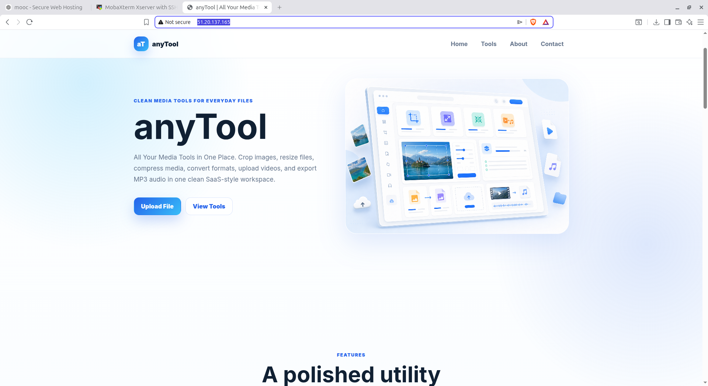
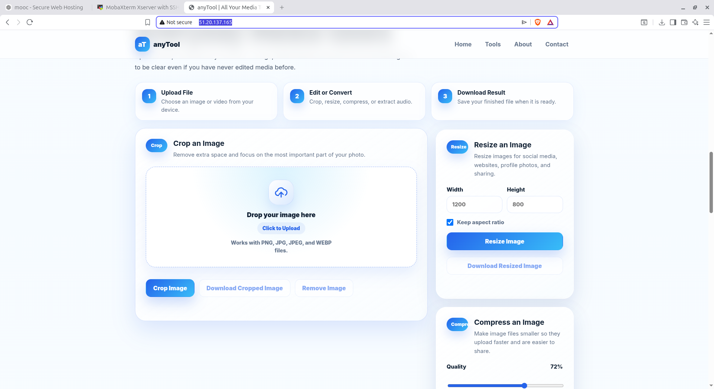
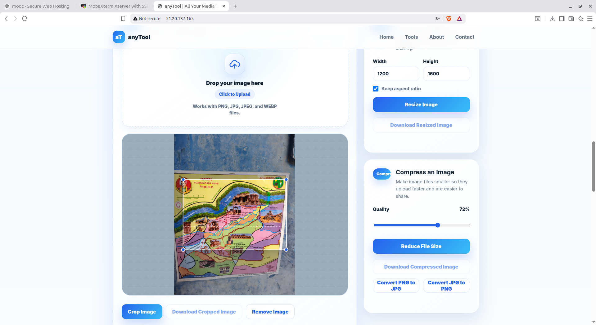
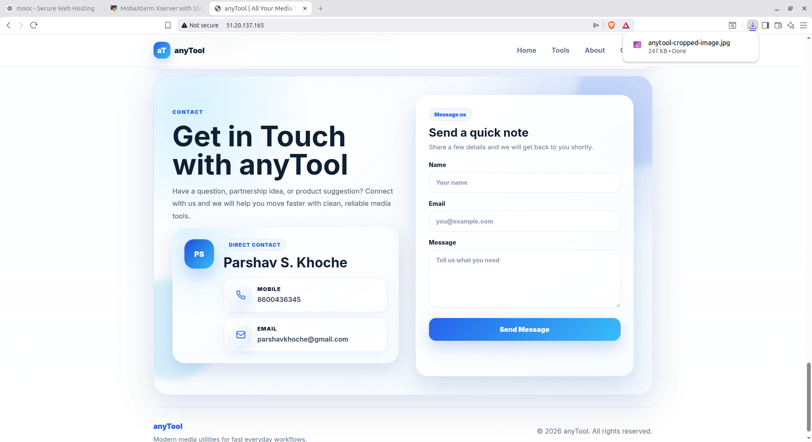
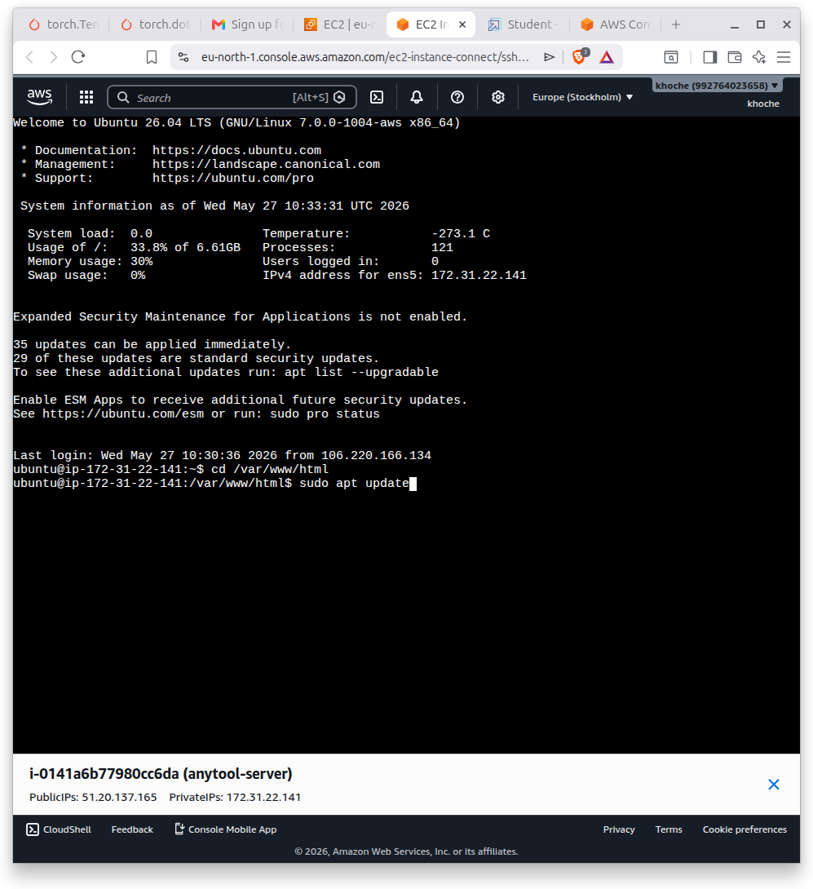

# anyTool

Modern SaaS-style media utility website deployed on AWS EC2.

---

## Live Demo

http://51.20.137.165

---

## Features

- Image Crop Tool
- Resize Image Tool
- Compress Image Tool
- PNG to JPG Conversion
- JPG to PNG Conversion
- Video to MP3 UI
- Responsive SaaS Design
- White & Blue Modern Theme
- AWS EC2 Deployment

---

## Technologies Used

- HTML5
- CSS3
- JavaScript
- AWS EC2
- Apache2
- Ubuntu Linux

---

## Project Screenshots

### Website Homepage


### Upload Tool


### Crop Image Tool


### Contact Form


### AWS EC2 Dashboard


---

## Deployment Steps

## 1. Clone Repository

```bash
git clone https://github.com/parshav42/anyTool.git
```

## 2. Open Project Folder

```bash
cd anyTool
```

## 3. Install Apache

```bash
sudo apt update
sudo apt install apache2 -y
```

## 4. Move Project Files

```bash
sudo cp -r * /var/www/html/
```

## 5. Start Apache

```bash
sudo systemctl start apache2
```

## 6. Enable Apache

```bash
sudo systemctl enable apache2
```
